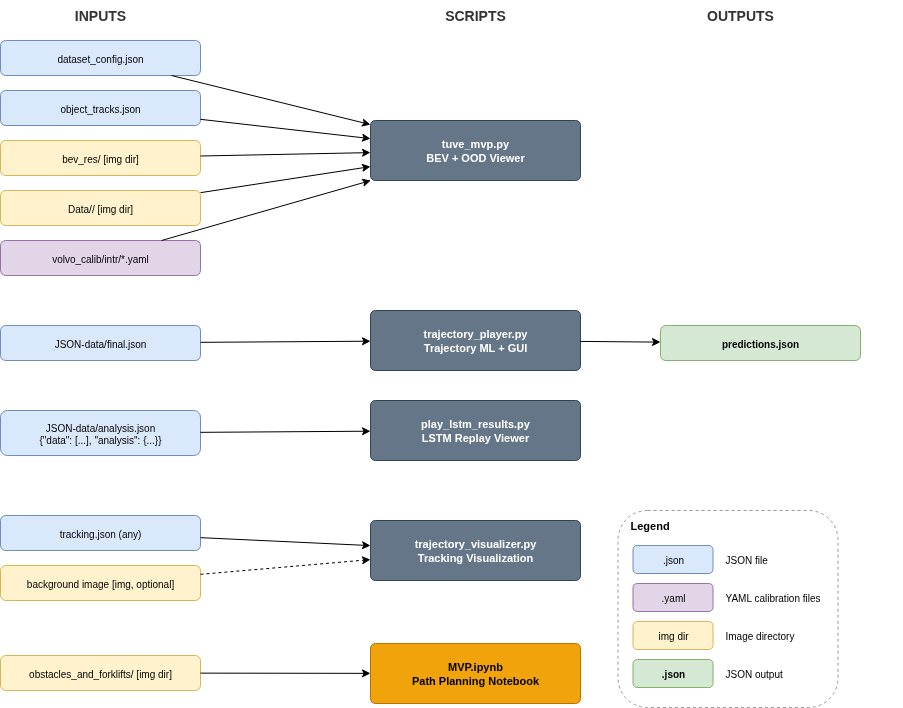

# How to populate the `Data` and `Models` directories

- **Volvo Tuve dataset**: - `WP6 - PrototypesDemonstrators (Volvo)\datasets\(CONFIDENTIAL)` 
- **Anomaly detections (Jesper)**: `WP6 - PrototypesDemonstrators (Volvo)\datasets\ood_detections`
- Play `JSON-data/final.json` and display trajectory + maneuver classes (Thanh). Original codes are at `P119522 - SMILE IV - General\Volvo Trajectories`.
- Play Joakim predictions (load analysis.json). Original codes are at `P119522 - SMILE IV - General\Joakim`:


# Quick start

Run `tree -L 2` to make sure that all the data files are correctly placed in your `Data`. 

> `Data` directory can be adjusted in `tuve_mvp.py` if you have the data outside the project directory, but **please do not push those changes to the repository**.

```
.
├── Data
│   ├── camera_visibility_lookup_table.pkl
│   ├── confidential_tuve_dataset
│   ├── JSON-data
│   ├── obstacles_and_forklifts
│   └── ood_detections
├── MVP.ipynb
├── play_lstm_results.py
├── README.md
├── requirements.txt
├── trajectory_player.py
├── trajectory_visualizer.py
├── tuve_mvp.py
├── undistorter.py
└── volvo_calib
    ├── extr
    └── intr
```
First create a new virtual environments and install dependencies, you only need to do this step **once**. 
```
python -m venv smile-env
source smile-env/bin/activate
# Activate it on Windows:  smile-env\Scripts\activate # To activate
pip install -r requirements.txt
```
> After doing the previous steps once, you can get into your virtual environment by running `source smile-env/bin/activate`

Run the project:

```
python trajectory_player.py  --gui
```
```
python -m ipykernel install --user --name=smile-env --display-name "Python (SMILE-IV)"

jupyter notebook MVP.ipynb
```

You can open `JSON-data/analysis.json` after running:
```
python play_lstm_results.py
```

```
python tuve_mvp.py
```



# Updates

## OOD scoring implemented by Erik
Based on the robot's position, the OOD score is pulled from every camera that can see the robot (based on the pre-computed bev-to-camera mapping `camera_visibility_lookup_table.pkl`). To view this in live action run:

```
python tuve_mvp.py --show-ood-viewer --ood-cameras 160-162
```


# Contribute

Before saving and committing your jupyter notebooks, go to the Jupyter menu:
> Kernel -> Restart & Clear All Output.

or initialize nbstripout in your repo to let git doing that automatically
```
nbstripout --install
```


# Issues
if you get the following error message:
```
qt.qpa.plugin: From 6.5.0, xcb-cursor0 or libxcb-cursor0 is needed to load the Qt xcb platform plugin.
qt.qpa.plugin: Could not load the Qt platform plugin "xcb" in "" even though it was found.
```
install:

```
sudo apt install libxcb-cursor0
```
